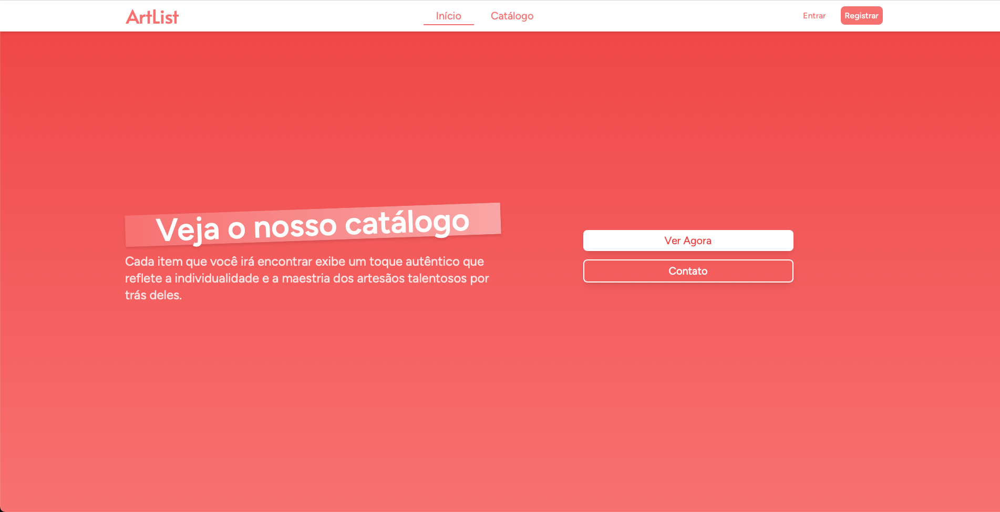
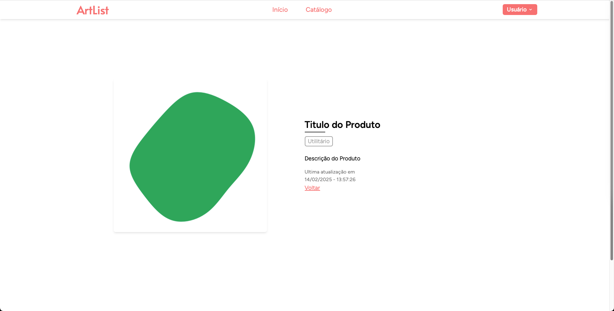
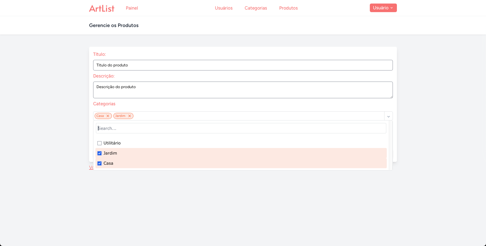

Vamos conhecer o **Artlist, um sistema de Gerenciamento de Produtos com Operações CRUD (Create, Read, Update, Delete)**? Este projeto é ideal para mostrar como um conceito básico pode ser levado a um novo nível com boas práticas, ferramentas modernas e paixão pelo desenvolvimento.

## O que é um Sistema CRUD?
CRUD representa as quatro operações fundamentais em uma aplicação que lida com qualquer tipo de dado:

* **Create (Criar):** Inserir novos dados no sistema
* **Read (Ler):** Consultar ou visualizar dados armazenados
* **Update (Atualizar):** Alterar informações já existentes
* **Delete (Excluir):** Remover dados permanentemente

Este projeto vai além do básico, aplicando princípios como arquitetura **MVC (Model-View-Controller)** e implementando tecnologias modernas para alcançar funcionalidade e interatividade.

## Visão Geral do Projeto
Este sistema de gerenciamento de produtos é uma aplicação web completa desenvolvida com foco em funcionalidade e usabilidade. Ele oferece um painel administrativo onde é possível gerenciar produtos e categorias (incluindo upload de imagens), além de contar com autenticação e controle de acesso à interface privada.

## Principais Tecnologias Utilizadas
* **Backend:** Laravel 10 x Laravel Breeze para autenticação
* **Frontend:** Tailwind CSS + Blade Components
* **Banco de Dados:** MySQL com Migrations e Seeders
* **Interatividade:** Vite e Alpine.js
* **Relacionamentos entre entidades:** Muitos-para-Muitos (N-N) entre produtos e categorias

## Estrutura do Projeto
Abaixo, você confere como a aplicação foi estruturada seguindo os padrões do Laravel:
```
app/
├── Http/Controllers/ # Controladores para gerenciar lógicas das entidades
├── Models/           # Modelos para validação e interação do banco de dados
database/
├── migrations/       # Esquema completo do banco de dados
├── seeders/          # Dados de exemplo para inicializar a aplicação
resources/views/
├── auth/             # Telas de login e registro
├── dashboard/        # Interface administrativa
├── layouts/          # Templates reutilizáveis
public/img/           # Armazenamento de imagens
routes/web.php        # Definições de rotas
```

## Setup e Uso
Se você deseja testar o projeto, siga as etapas abaixo:
1. Clone o repositório:
```bash
git clone https://github.com/carloshdrp/CRUD-Laravel
```
2. Instale as dependências do Laravel e da interface:
```bash
composer install && npm install
```
3. Configure o arquivo ``.env`` com os dados do seu banco de dados.

4. Execute as migrações e seeds:
```bash
php artisan migrate --seed
```
5. Inicialize o servidor local:
```bash
php artisan serve
```
6. Acesse a aplicação em http://localhost:8000.

## Galeria do Projeto
#### Página Inicial


#### Visualização do Produto


#### Categorias


#### Edição de Produtos


## Acesse o Código
Gostou do que viu e quer saber mais? Todo o código está disponível no meu repositório GitHub. Confira, contribua, ou compartilhe feedbacks!

Espero que este projeto tenha sido interessante para você! Se tiver dúvidas ou quiser conversar sobre desenvolvimento, sinta-se à vontade para entrar em contato. 😊