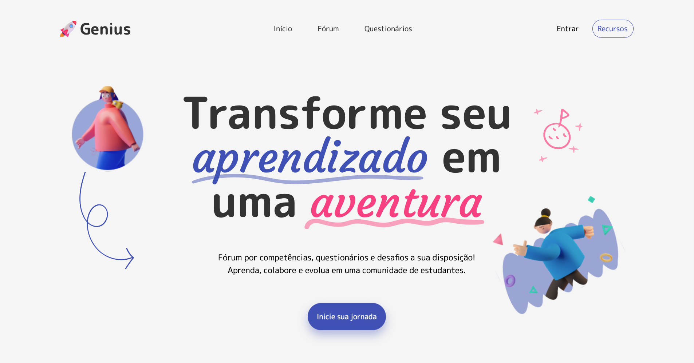
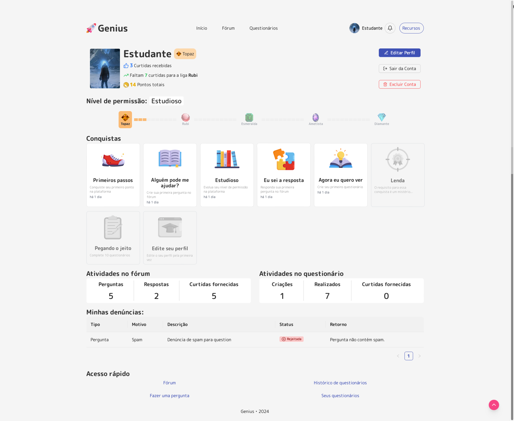
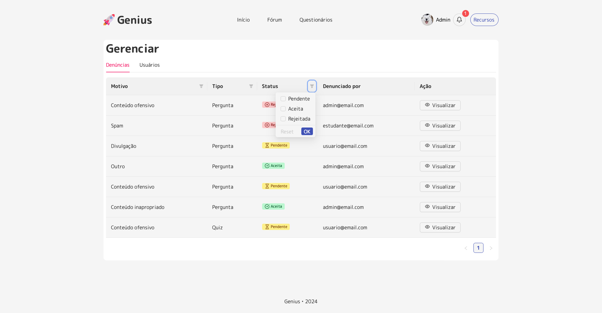

## Planejamento e arquitetura

O desenvolvimento do Genius seguiu uma abordagem de fácil manutenção. O projeto foi dividido em duas principais frentes: cliente (frontend) e servidor (backend).

```
├── frontend/
│   ├── src/
│   │   ├── api/           / Métodos de requisição via Redux Toolkit
│   │   ├── assets/        / Recursos estáticos
│   │   ├── components/    / Componentes React reutilizáveis
│   │   ├── config/        / Configurações (Socket.io, variáveis)
│   │   ├── pages/         / Páginas da aplicação
│   │   ├── redux/         / Estados e reducers do Redux Toolkit
│   │   ├── styles/        / Estilização CSS
│   │   └── utils/         / Funções utilitárias
│
├── backend/
│   ├── config/            / Configurações do servidor
│   ├── controllers/       / Controladores de requisições
│   ├── files/             / Armazenamento de avatares
│   ├── middlewares/       / Middlewares de autenticação/validação
│   ├── prisma/            / Schema e migrações do banco
│   ├── routes/            / Definição de rotas
│   ├── services/          / Lógica de negócio e operações do Prisma
│   ├── utils/             / Funções utilitárias
│   └── validations/       / Schemas de validação com Joi
```

## Funcionalidades Principais

- Sistema de ligas baseado em contribuições e avaliações da comunidade;
- Fórum de perguntas e respostas para troca de conhecimentos;
- Questionários com feedback imediato;
- Sistema de conquistas e pontuações;
- Notificações em tempo real;
- Sistema progressivo de permissões baseado em contribuições.

## Tecnologias Utilizadas

### Frontend

- <a href="https://react.dev" target="_blank" rel="noopener noreferrer">React</a> com JavaScript;
- <a href="https://tailwindcss.com" target="_blank" rel="noopener noreferrer">TailwindCSS</a> para estilização;
- <a href="https://ant.design" target="_blank" rel="noopener noreferrer">Ant Design</a> para componentes de interface;
- <a href="https://redux-toolkit.js.org" target="_blank" rel="noopener noreferrer">Redux Toolkit</a> para gerenciamento de estado;
- <a href="https://socket.io" target="_blank" rel="noopener noreferrer">Socket.io</a> para comunicação em tempo real.

### Backend

- <a href="https://nodejs.org/pt" target="_blank" rel="noopener noreferrer">Node.JS</a> com <a href="http://expressjs.com/pt-br/" target="_blank" rel="noopener noreferrer">Express</a>;
- <a href="https://www.prisma.io" target="_blank" rel="noopener noreferrer">Prisma</a> como **ORM** ;
- <a href="https://www.mysql.com" target="_blank" rel="noopener noreferrer">MySQL</a> como **SGBD** ;
- JWT para autenticação através do <a href="https://www.passportjs.org" target="_blank" rel="noopener noreferrer">Passport.js</a>.

### Desenvolvimento

- <a href="https://documenter.getpostman.com/view/26689861/2sAYJ4igB1" target="_blank" rel="noopener noreferrer">Documentação da API com o Postman</a>;
- Prototipagem das telas no Figma;
- ESLint para padronização;
- Prettier para formatação;
- Controle de versão com GIT.

## Resultados

Implementando uma abordagem gamificada para educação, alinhada com as diretrizes da Base Nacional Comum Curricular (BNCC), o projeto foi apresentado e aprovado em novembro de 2024 como requisito para obtenção do grau de Técnico em Informática para Internet no Instituto Federal Sul-rio-grandense, Campus Gravataí.

## Telas

Tela inicial


Tela de perfil


Tela de denúncias (restrita aos administradores)

