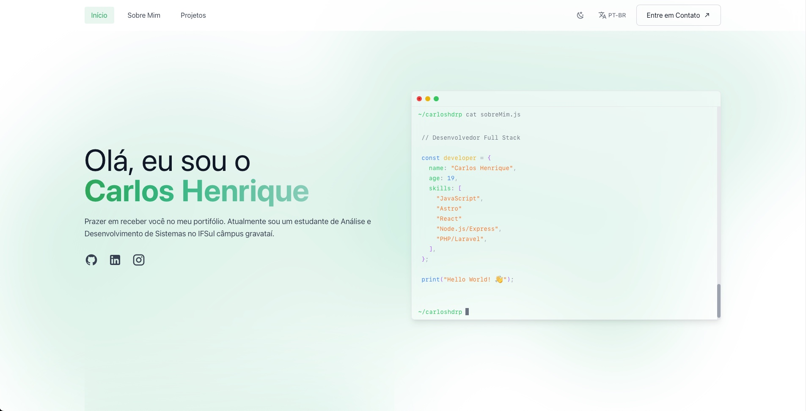
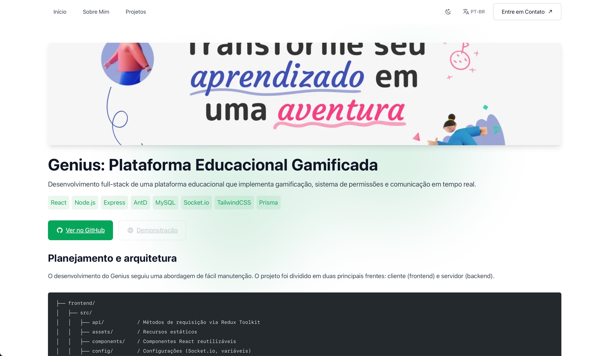

## 🔍 Destaques do Projeto  
Este projeto oferece uma apresentação profissional dos meus trabalhos e habilidades, demonstrando domínio técnico em tecnologias atuais como Astro, TypeScript e TailwindCSS. Seguindo boas práticas de desenvolvimento, ele inclui acessibilidade, arquitetura eficiente e código limpo, além de contar com internacionalização completa, suportando português e inglês de forma dinâmica.

## 🛠️ Tecnologias e Recursos  
Para garantir um site rápido e performático, utilizei o Astro na criação de páginas estáticas, combinado com TypeScript para maior confiabilidade no código e TailwindCSS para uma estilização moderna e responsiva. A qualidade e padronização são mantidas com ferramentas como ESLint e Prettier, enquanto a integração com GitHub Actions automatiza processos de CI/CD.

### 🌟 Foco em Performance e SEO  
Técnicas de otimização forma utilizadas para garantir alto desempenho, com geração estática de páginas, lazy loading para carregamento eficiente de imagens e código compacto para produção. Além disso, oferece suporte automático para sitemap, robots.txt e web manifest, assegurando uma excelente experiência de usuário e otimização para motores de busca.

### 🌍 Internacionalização
O site possui suporte completo, tanto na interface quanto nas postagens, para os idiomas português e inglês, com detecção automática do idioma baseado nas preferências de navegador do visitante e conforme a rota utilizada.

### Interface e Experiência
O design é totalmente responsivo, com suporte a temas claro e escuro, além de animações suaves e interativas que tornam a navegação mais envolvente.

## Estrutura de diretórios:
- `public/` – Arquivos estáticos do projeto (imagens, fontes).
- `src/content/` – Conteúdo do portfólio em Markdown com suporte a múltiplos idiomas.
- `src/components/` – Componentes reutilizáveis.
- `src/layouts/` – Layouts padrão para as páginas.
- `src/i18n/` – Arquivos de tradução e detecção de idioma.
- `src/styles/` – Estilos globais com TailwindCSS.

## Telas
#### Tela inicial

#### Tela interna de projetos

## 🚀 Explore Mais
Todo o código-fonte está disponível no GitHub para referência e uso por outros desenvolvedores.
Se você deseja saber mais, entre em contato. Fico sempre animado para compartilhar ideias e aprender com a comunidade!